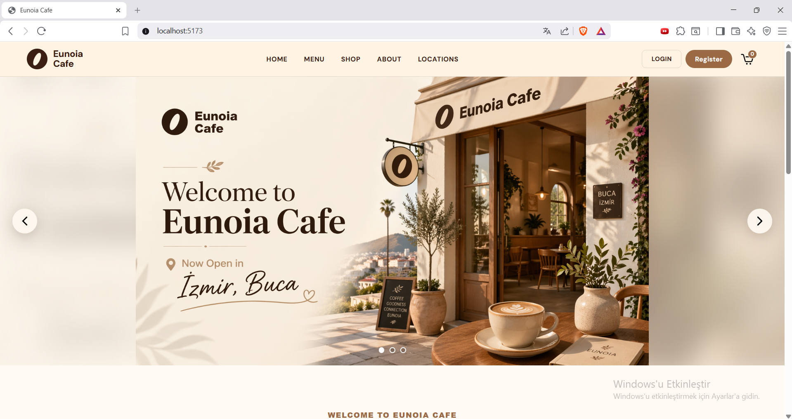
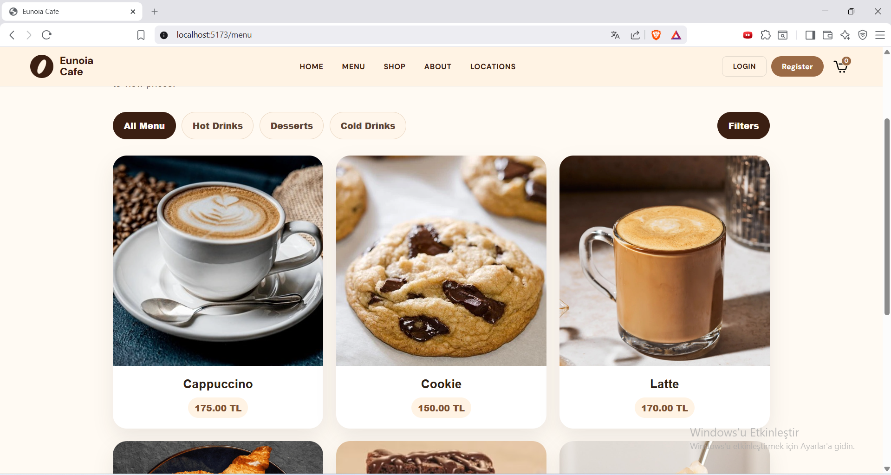
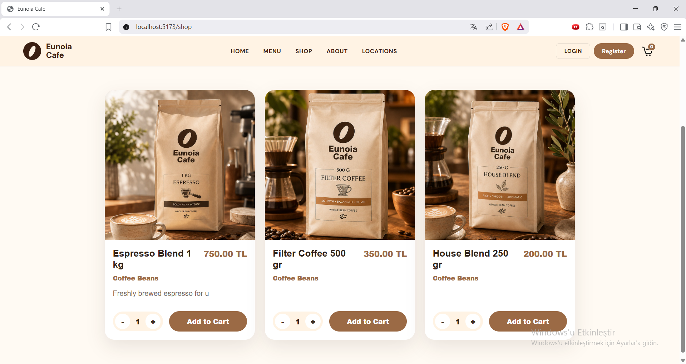
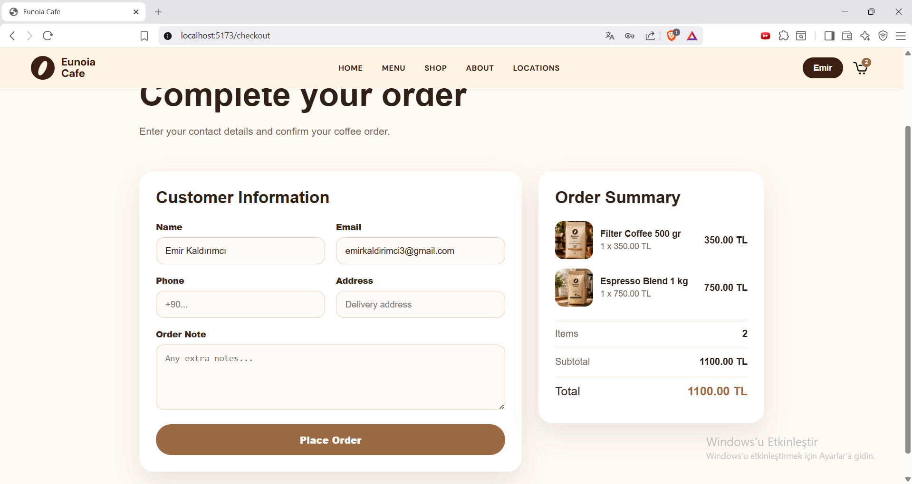
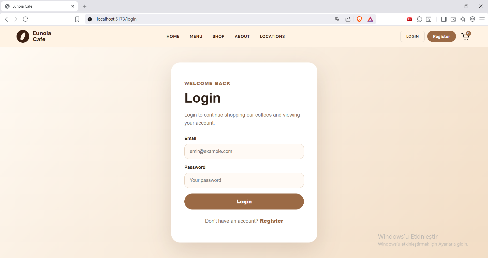
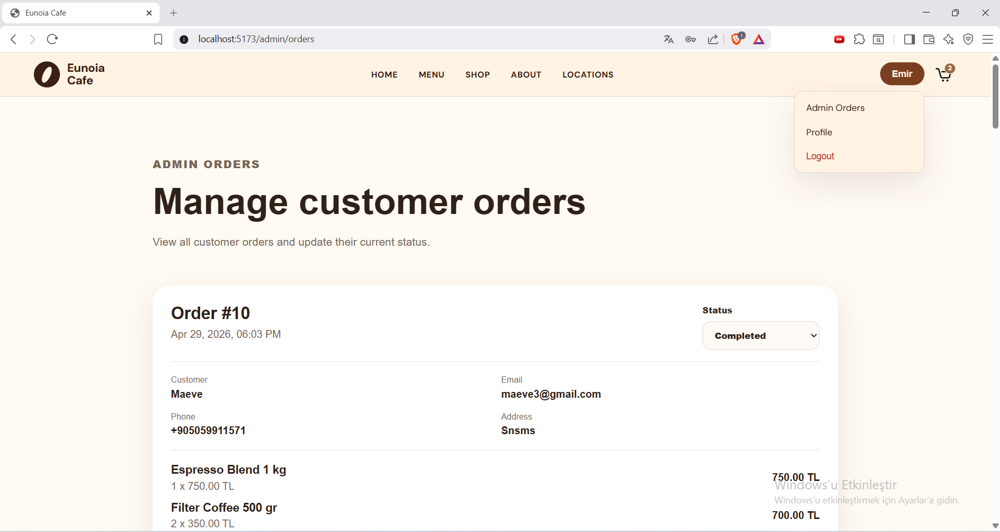
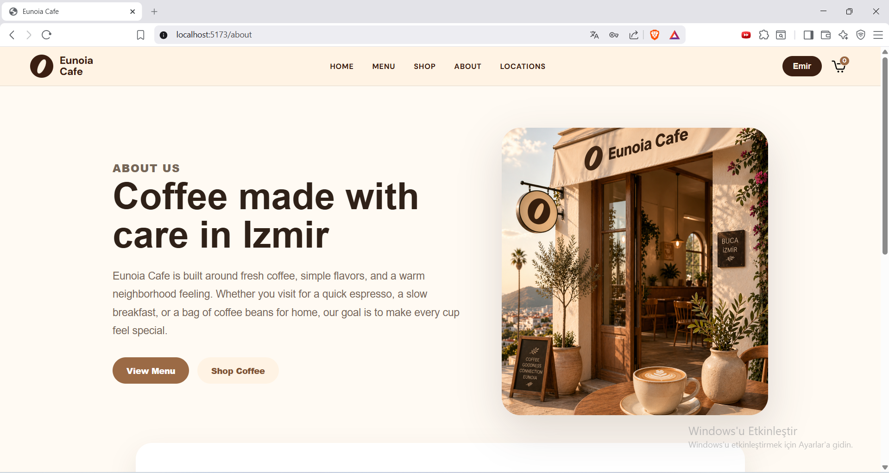
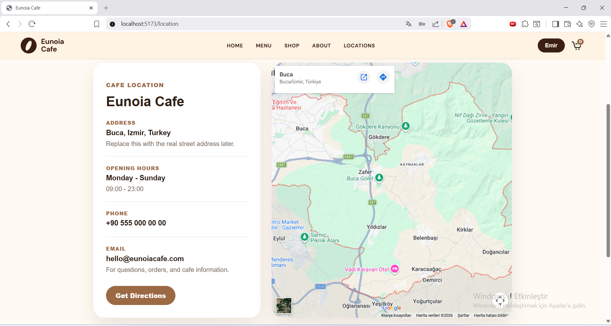

# Eunoia Cafe Full Stack

Full-stack cafe application with a React/Vite client and an Express/Prisma/PostgreSQL API.

## Features

- Customer registration, login, profile, cart, checkout, and order history
- Admin product/category management for menu and shop sections
- Admin order management with status updates
- Server-side order total calculation
- Product image upload, validation, resizing, and static serving

## Screenshots

| Home | Menu |
| --- | --- |
|  |  |

| Shop | Checkout |
| --- | --- |
|  |  |

| Login | Admin Orders |
| --- | --- |
|  |  |

| About | Locations |
| --- | --- |
|  |  |

## Project Structure

```text
client/  React + TypeScript + Vite
server/  Express + TypeScript + Prisma + PostgreSQL
```

## Setup

1. Install dependencies:

```bash
cd server
npm install
cd ../client
npm install
```

2. Create environment files:

```bash
cp server/.env.example server/.env
cp client/.env.example client/.env
```

3. Update `server/.env` with your PostgreSQL URL and JWT secret.

4. Run Prisma migrations:

```bash
cd server
npx prisma migrate dev
```

5. Start the apps in separate terminals:

```bash
cd server
npm run dev
```

```bash
cd client
npm run dev
```

## Useful Commands

```bash
cd server
npm run typecheck
npm test
npm run build
```

```bash
cd client
npm run lint
npm run build
```
